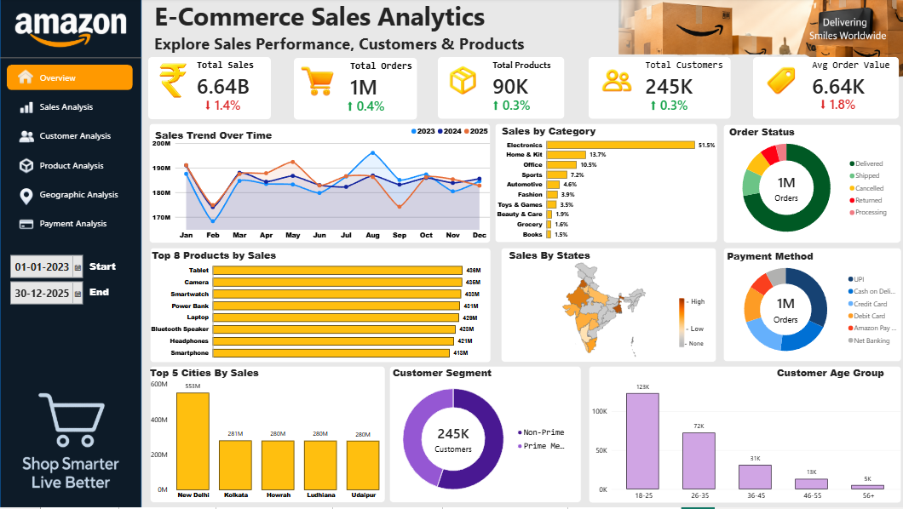

# 🛒 E-Commerce Sales Analytics Dashboard

An interactive **E-Commerce Sales Analytics Dashboard** built with **Microsoft Power BI** to analyze sales performance, customer behavior, product performance, geographic trends, and payment methods.

> ⚠️ **Dataset Disclaimer**
>
> The dataset used in this project is **synthetically created for portfolio and learning purposes**. It is **not original or real Amazon transactional data** and does not represent actual Amazon sales, customers, products, or business performance.

The project transforms a self-created e-commerce transaction dataset into an interactive business intelligence dashboard designed to demonstrate data cleaning, data modeling, DAX, data visualization, and business analysis skills.

---

## 📊 Dashboard Preview

### Overview



### Sales Analysis


### Customer Analysis


### Product Analysis


### Geographic Analysis


### Payment Analysis


---

## 🎯 Project Objective

The objective of this project is to build an interactive analytics solution that helps understand:

- Overall sales and order performance
- Monthly and quarterly sales trends
- Customer acquisition and retention
- Product and category performance
- Geographic sales distribution
- Payment method performance
- Regional sales and order trends

---

## 🛠️ Tools & Technologies

- **Power BI** – Data transformation, data modeling, DAX, and dashboard development
- **Power Query** – Data cleaning and transformation
- **DAX** – Measures, KPIs, time intelligence, and analytical calculations
- **CSV** – Source dataset
- **Git & GitHub** – Project version control and portfolio management
- **Git LFS** – Large dataset and Power BI file storage

---

## 📁 Dataset

This project uses a **synthetically generated e-commerce transaction dataset created specifically for this portfolio project**.

The dataset is designed to simulate an e-commerce business environment and contains information about:

- Orders
- Customers
- Products
- Categories
- Brands
- Locations
- Payment methods
- Discounts
- Taxes
- Shipping costs
- Order status
- Product ratings

> **Important:** This dataset is fictional and should not be interpreted as real Amazon business data or actual customer information.

The raw dataset is available in:

`Data Set/amazon_sales_dataset.csv`

---

## 📈 Dashboard Pages

### 1. Overview

Provides a high-level summary of the e-commerce business.

Key metrics include:

- Total Sales
- Total Orders
- Total Products
- Total Customers
- Average Order Value

The page also provides an overview of sales trends, categories, order status, payment methods, top products, cities, customer segments, and age groups.

---

### 2. Sales Analysis

Focuses on sales performance and trends.

Key analysis includes:

- Monthly Sales & Orders
- Sales by Quarter
- Sales by Day of Week
- Sales by Month Heatmap
- Sales by Prime Membership
- Total Quantity Sold
- Average Order Value

---

### 3. Customer Analysis

Analyzes customer characteristics and behavior.

Key analysis includes:

- Total Customers
- New Customers
- Repeat Customers
- Customer Gender
- Customer Age Groups
- Customer Type
- Top Cities by Customers
- New vs Repeat Customer Trend

---

### 4. Product Analysis

Analyzes product and category performance.

Key analysis includes:

- Total Products
- Top Category
- Best Selling Product
- Average Product Rating
- Sales by Category
- Top 10 Products by Sales
- Sales by Brand
- Product Rating Distribution
- Units Sold vs Revenue by Category
- Discount vs Sales by Category

---

### 5. Geographic Analysis

Analyzes sales performance across locations.

Key analysis includes:

- Total Sales
- Total Orders
- Total Cities
- Total States
- Sales by State
- Sales by Region
- Orders by Region
- Sales Trend by Region

---

### 6. Payment Analysis

Analyzes transaction performance across payment methods.

Key analysis includes:

- Total Sales
- Total Orders
- Total Quantity Sold
- Average Order Value
- Payment Method Share
- Sales by Payment Method
- Orders by Payment Method
- Average Order Value by Payment Method
- Monthly Sales Trend by Payment Method

---

## 📌 Key KPIs

| KPI | Value |
|---|---:|
| Total Sales | ₹6.64B |
| Total Orders | 1M |
| Total Products | 90K |
| Total Customers | 245K |
| Average Order Value | ₹6.64K |
| Total Quantity Sold | 2M |
| Total Cities | 28 |
| Total States | 12 |

---

## 🔍 Key Insights

Some of the major observations from the dashboard include:

- **Electronics** is the leading product category by sales.
- **Tablet** is the best-selling product by sales.
- **North** is the highest-performing region by sales.
- **New Delhi** is the leading city by customer count and sales.
- **UPI** contributes the highest sales among the available payment methods.
- Repeat customers represent a significantly larger customer base than new customers.
- Product ratings are concentrated around **4 and 5 stars**.
- Sales performance varies across regions and payment methods over time.

---

## ⚙️ Data Preparation & Analysis Workflow

```text
Self-Created Synthetic Dataset
            ↓
       Power Query
            ↓
Data Cleaning & Transformation
            ↓
       Data Modeling
            ↓
     DAX Measures & KPIs
            ↓
Interactive Power BI Dashboard
            ↓
      Business Insights
